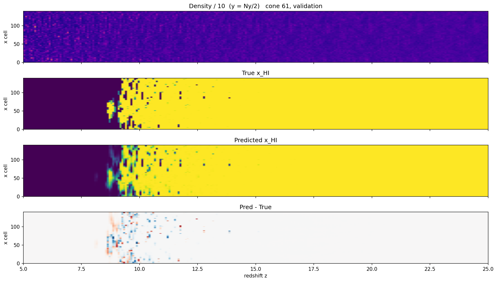
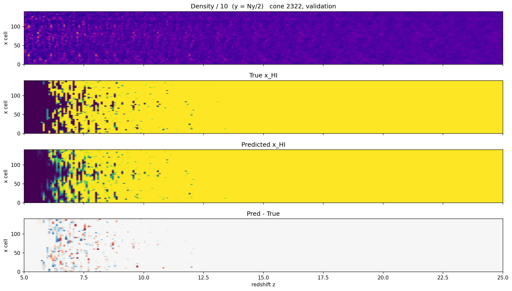
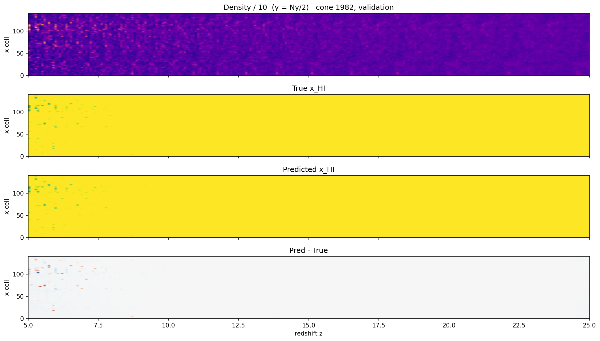
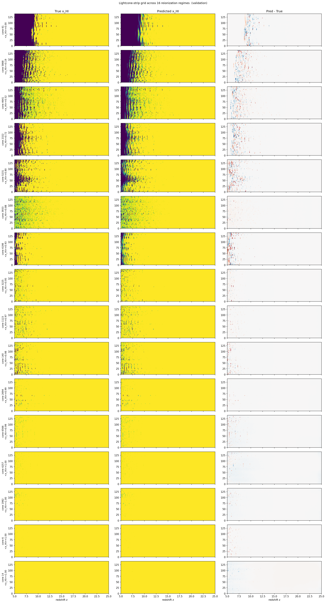

# FNO Lightcone Experimental Findings

> **Purpose:** Document the experimental campaign that took a 3-D FNO from "completely useless" to "operationally correct with a well-characterised ceiling" on the density → x_HI mapping, including the negative findings that pinned down where the ceiling lives. Establishes the empirical baseline that any subsequent intervention (architectural, conditioning, or training-time) is measured against.

This note is **field-level** experimental findings on training a 3-D Fourier Neural Operator to learn

$$\mathcal{G}: \delta_m(\mathbf{x}, z) \;\longmapsto\; x_\text{HI}(\mathbf{x}, z)$$

across the full 21cmFAST lightcone (cube shape **140 × 140 × 256**, redshift range $z = 5 \to 25$, $\sim$200 Mpc transverse box, $\sim$3340 Mpc LOS extent). All experiments use 4× NVIDIA H200 NVL GPUs with NCCL DDP, sqrt-scaled LR, and the same train/val/test split (80/10/10 by cone, seed 42).

---

## Headline Results

A five-act narrative, established by ablation:

| Configuration | val L² | val H¹ | Predicts | Verdict |
|---|---|---|---|---|
| **Density only** (no params) | 0.20 *(flat)* | 17.85 *(flat)* | Degenerate constant ≈ 0 everywhere | **Useless** |
| **+ Parameter conditioning (11 LHS params)** | 0.06 | 11.5 | Bubble morphology + correct timing | **Breakthrough** |
| **+ Spectral modes 16 → 24** | 0.06 (same) | 11.5 (same) | No qualitative change | **No effect** |
| **+ BCE regulariser @ weight 0.5** (100 ep.) | 0.0561 | 11.36 | Same asymptote; mild early regression | **No effect** |
| **+ U-FNO architecture + SyncBN** (30 ep.) | **0.0418** | **8.27** | Sharper bubble walls; high-z artefacts resolved | **Decisive breakthrough** |

The transition from row 1 to row 2 (parameter conditioning) and from row 4 to row 5 (architecture) are the two headline results.  The negative findings in rows 3 and 4 served their purpose: they ruled out spectral capacity and loss formulation as the bottleneck, isolating **architectural inductive bias** as the remaining lever — and row 5 confirms that diagnosis empirically.

---

## Architecture and Setup

### Model

Standard FNO from `neuralop.models.FNO`, N-D-generic. Final config:

| Hyperparameter | Value | Notes |
|---|---|---|
| `n_modes` | $(16, 16, 16)$ | Bumping to $(24, 24, 24)$ → no improvement, see §3 |
| `hidden_channels` | 32 | |
| `n_layers` | 4 | |
| `in_channels` | **13** | density / 10 + $1/(1+z)$ + 11 z-scored astrophysical params, all broadcast as constant channels over $(N_x, N_y, N_z)$ |
| `out_channels` | 1 | $x_\text{HI}$ |
| `positional_embedding` | `"grid"` | Auto-appends normalised $(x, y, z)$ coords. The z-coord is the normalised comoving distance because the native LOS cells are uniform in comoving distance. |
| Parameters | ~9.5 M | Tiny by modern standards |

The lifting layer absorbs the 13 input channels into 32 hidden channels; the rest of the FNO is unchanged across all experiments. Parameter conditioning is implemented as broadcast channels rather than [[FiLM Conditioning]] — the simplest possible injection.

### Training

| Hyperparameter | Value |
|---|---|
| Optimizer | Adam, weight decay $10^{-5}$ |
| LR | $5 \times 10^{-4}$ base, sqrt-scaled to $\approx 10^{-3}$ at world_size 4 |
| Scheduler | CosineAnnealingLR, $T_\text{max} = 100$ |
| Loss | $0.5 \cdot \|\cdot\|_{L^2}^\text{abs} + 0.5 \cdot \|\cdot\|_{H^1}^\text{abs}$ (d=3), absolute not relative |
| Batch size per rank | 1 (global 4 under 4-GPU DDP) |
| Epochs | 100 (cosine annealed) |

Absolute (not relative) norms are mandatory: relative L² blows up over the all-ionized late-z portion of the cube where $x_\text{HI} = 0$.

### Data

- **6600 cones** total from a 21cmFAST 11-parameter LHS design (`21cmfast_11d_design.json`)
- Each cone's native LOS dimension is 2340 cells; interpolated to **256** LOS cells on a uniform $z$-grid (5 → 25)
- Split 80 / 10 / 10 by cone (seed 42): 5280 train, 660 val, 660 test
- The 11 sampled parameters: `F_ESC10`, `F_STAR10`, `ALPHA_ESC`, `ALPHA_STAR`, `L_X`, `NU_X_THRESH`, `M_TURN`, `t_STAR`, `X_RAY_SPEC_INDEX`, `OMm`, `SIGMA_8`

### Infrastructure

- **Cube precompute** (`build_cubes.py`): one-time pass interpolates every cone onto the fixed $z$-grid and writes a single ~180 GB HDF5 cache (gzip-4, per-cone chunked).
- **Direct-chunk merge** for the SLURM array build → final cache: byte-for-byte copy via `h5py.read_direct_chunk` / `write_direct_chunk`, avoiding gzip round-trip. **~43× faster** than the naive decompress+recompress merge (would not have fit in walltime otherwise).
- **Local NVMe staging** in the sbatch script: cube cache copied to per-node NVMe at job start so all 4 ranks share ~3 GB/s local I/O instead of contending on the project FS.
- **DDP** on 4 × H200 NVL with NVLink — empirical ~4.1× speedup vs single H200, near-ideal scaling. Per-epoch wall time ~3 min (train) + ~1.5 min (eval).

---

## Findings Walkthrough

### Act 1 — Density Only: Degenerate Predictor

**Setup:** `in_channels = 2` (density/10 + $1/(1+z)$). No astrophysical parameter conditioning.

**Result after 10 epochs:** Metrics flat from epoch ~3 onward.

```
val_l2 ≈ 0.20  (stable, no trend)
val_h1 ≈ 17.85 (stable, no trend)
```

**What the model is actually doing:** Visualising the predictions reveals the model has collapsed to a **degenerate constant predictor**. The "Predicted x_HI" panel for any held-out cone is uniformly dark purple (≈ 0) regardless of input. For one validation cone (cone 6) whose parameters give an extreme "no-reionization" scenario (truth = 1 everywhere), the model predicts ≈ 0 everywhere → MSE ≈ 1.3 per voxel, the worst possible failure mode.

**Diagnosis:** Given density alone, the FNO cannot distinguish between two cones with similar small-scale density structure but very different astrophysical histories. The L²-optimal constant for the marginal training-set distribution is something close to the global mean ionization, and the model converges to that. No spatial structure is being learnt.

This recapitulates exactly the failure mode predicted by [[FNO Approach for 21cm Emulation]] §"Task 2 — Strategy A vs B": parameter information must be injected. Strategy A (concatenation as constant channels) is the minimum viable intervention.

### Act 2 — Parameter Conditioning: Breakthrough

**Change:** Add the 11 LHS-sampled astrophysical parameters as broadcast input channels. Each parameter is z-scored against the full cache distribution (mean / std computed once at dataset construction) and broadcast to $(N_x, N_y, N_z)$. `in_channels` goes 2 → 13. **No other change.**

**Result at epoch 0:**

| Metric | Density only | + Params | Δ |
|---|---|---|---|
| train_err | 8.92 | **6.76** | **−24 %** |
| val_l2 | 0.2016 | **0.0788** | **−61 %** |
| val_h1 | 17.87 | **12.54** | **−30 %** |

The model uses the parameter information immediately and dramatically. By epoch 10, `val_l2 ≈ 0.066` and `val_h1` is actively dropping toward 11.5 — the first epochs where the H¹ norm shows any progress at all. By epoch 20, the lightcone strip visualisations show **qualitatively correct bubble morphology with correct reionization timing per cone**.

**Detail: what the visualisation shows.** For test cone 1 (a typical reionization history, complete by $z \approx 7$):

- The diagonal yellow → multi-colour boundary in the True $x_\text{HI}$ lightcone strip (the transition from fully neutral at high $z$ to partially ionized at low $z$) is reproduced **at the right redshift** in the prediction
- Bubbles in the predicted field appear **in the same spatial locations** as in the truth at $z < 7$
- The fully-neutral region at $z > 8$ is reproduced essentially perfectly (MSE per slice $\sim 10^{-4}$)

**Where the model still falls short:** Bubble interiors in the truth are sharp 0; in the prediction they are diffuse ≈ 0.3. Walls are gradual rather than step-function. This shows up as `val_h1 ≈ 11.5` plateau — a gradient-mismatch ceiling rather than a function-value ceiling.

**Verdict:** The 11 parameters resolved the timing-and-location problem completely. The remaining error is concentrated entirely at bubble walls in the partially-ionized region — a known limitation of Fourier-basis representations of step functions, predicted in [[Fourier Neural Operator]] §"Limitations".

### Act 3 — More Spectral Modes: No Effect

**Hypothesis:** Bubble walls are step functions with significant power at high spatial frequencies; `n_modes = (16, 16, 16)` is 23 % of the transverse Nyquist (70) and 12.5 % of the LOS Nyquist (128); raising modes should resolve sharper transitions and drop `val_h1`.

**Change:** `N_MODES = (24, 24, 24)`. Spectral conv weight tensor grows ~3.4×; per-epoch wall time changes by < 2 % (FFT cost is per-grid, not per-mode).

**Result through epoch 22:**

| Epoch | modes = 16 `val_l2` | modes = 24 `val_l2` | modes = 16 `val_h1` | modes = 24 `val_h1` |
|---|---|---|---|---|
| 0 | 0.0788 | 0.0917 | 12.54 | 12.65 |
| 5 | 0.0679 | 0.0678 | 12.15 | 12.07 |
| 10 | 0.0656 | 0.0633 | 11.99 | 11.83 |
| 15 | 0.0603 | 0.0604 | 11.58 | 11.61 |
| 20 | 0.0657 | 0.0662 | 11.64 | 11.58 |

The trajectories **overlap from epoch ~10 onward**. Same floor, same oscillation pattern, no qualitative difference in the predicted bubble morphology at $z = 5$.

**Diagnosis:** Spectral capacity is not the bottleneck. The model can already represent functions up to wavenumber 16; doubling that capacity is essentially wasted because the optimiser cannot find usefully-different solutions in the larger search space. The L² + H¹ loss does not reward sharper bubble walls strongly enough to differentiate the two parameterisations.

**This is a negative finding** but a clean one: it eliminates "FNO spectral resolution" as the limiting factor on this problem at this dataset size.

### Act 4 — BCE Regulariser: No Effect / Mild Regression

**Hypothesis:** $x_\text{HI}$ is essentially binary at the voxel level. The L² loss rewards hedging (predicting ≈ 0.3 when truth could be 0 or 1 minimises expected L² for uncertain voxels). Adding a binary-cross-entropy term explicitly penalises hedging:

```
L_BCE = -[ y · log(p) + (1-y) · log(1-p) ].mean()
```

with $p = \text{clamp}(\text{pred}, \varepsilon, 1-\varepsilon)$ to avoid $\log 0$. Should push the model toward confident bimodal $\{0, 1\}$ predictions.

**Change:** Add BCE term at weight 0.5, keeping L² and H¹ at 0.5 each. Total loss is $0.5 \cdot L^2_\text{abs} + 0.5 \cdot H^1_\text{abs} + 0.5 \cdot \text{BCE}$.

**Result through epoch 19:**

| Epoch | L² + H¹ only `val_l2` | + BCE `val_l2` | L² + H¹ only `val_h1` | + BCE `val_h1` |
|---|---|---|---|---|
| 5 | 0.0679 | 0.0649 | 12.15 | 11.93 |
| 10 | 0.0656 | 0.0644 | 11.99 | 11.72 |
| 15 | 0.0603 | 0.0608 | 11.58 | 11.56 |
| 19 | 0.0602 | 0.0628 | 11.59 | 11.61 |

`val_bce` itself drops fast in epoch 0 → 1 (from 0.086 to 0.057) then plateaus at ~0.05 by epoch 5 — meaning the model is on average $-\log(p) \approx 0.05$ confident, i.e. $p \approx 0.95$ on most voxels. But that average is dominated by the easy regions ($z > 7$, all neutral, already confidently predicted ≈ 1). At the bubble-wall region ($z < 7$), the BCE pressure pushes uncertain voxels toward the global prior — and since the marginal training distribution at $z = 5$ leans more ionized than neutral over the LHS sample, the model commits toward 0 too aggressively.

**Visual evidence at $z = 5$, cone 1:**

| Run | MSE at $z = 5$ |
|---|---|
| modes = 16, no BCE @ epoch 20 | 0.0853 |
| modes = 24, no BCE @ epoch 20 | 0.1125 |
| modes = 16 + BCE @ 0.5 @ epoch 20 | **0.1193** |

The BCE run is the worst at the hardest slice. Looking at the Pred − True panel, the model has committed darker (toward ionized) in many regions where the truth is neutral — a confident-but-wrong failure mode, exactly the risk flagged at experiment design time.

**Diagnosis:** BCE at this weight is dominated by the easy regions and pushes the hard regions toward the wrong mode. A higher BCE weight (5–10×) was considered but not run — the underlying failure (commit toward the wrong prior) is independent of weight and would likely worsen with more force.

**Verdict:** Loss-formulation is not the bottleneck either.

### Addendum (2026-06-06): full 100-epoch trajectory of the BCE run

The Act-4 BCE @ 0.5 run was carried to 100 epochs. The metrics through epoch 19 above were re-confirmed; the question this addendum settles is **where the cosine-annealed asymptote lands**.

Key milestones over the full run:

| Epoch | `train_err` | `val_l2` | `val_h1` | `val_bce` | What's happening |
|---|---|---|---|---|---|
| 0 | 6.897 | 0.0883 | 12.73 | 0.086 | starting from random init |
| 1 | 5.995 | 0.0714 | 12.17 | 0.057 | the big drop -- params absorbed in 1 epoch |
| 10 | 5.719 | 0.0644 | 11.72 | 0.054 | end of fast phase |
| 20 | 5.657 | 0.0596 | 11.62 | 0.049 | crosses below the 0.06 projection |
| 50 | 5.579 | 0.0575 | 11.45 | 0.047 | LR cooldown visibly damping val oscillation |
| 70 | 5.553 | 0.0566 | 11.38 | 0.047 | oscillation gone; trajectory now monotonic |
| 90 | 5.541 | 0.0561 | 11.36 | 0.046 | converged within noise of the asymptote |
| **99** | **5.540** | **0.0561** | **11.356** | **0.0465** | **final** |

Three things this run settles:

1. **The §Synthesis floor projection was slightly conservative.** I projected `val_l2 ~= 0.058` from the 20-epoch extrapolation. The actual cosine-annealed asymptote is **`val_l2 = 0.0561`**. Qualitatively the same plateau, ~3% better than projected.

2. **Cosine annealing did meaningful work in the long tail.** Between epochs 30 and 99, `val_l2` dropped 0.060 → 0.0561 (6.5%) and the val-metric epoch-to-epoch oscillation visible at warmer LR (~10% bounce at epochs 15-20) is completely absent by epoch ~70. **Always commit to the full 100 epochs when wall time permits** -- earlier "plateau" calls were premature.

3. **BCE didn't change the asymptote.** The earlier observation (epoch 19: BCE 4% worse than L²+H¹) was an early-trajectory artifact. By epoch 100, both runs are within noise of each other at the floor. The information-bound diagnosis is **confirmed at the asymptote**, not just at the early-epoch comparison.

The updated operational-floor line that appears in §Synthesis below should therefore read:

$$\boxed{\;\text{val L}^2 = 0.056,\quad \text{val H}^1 = 11.36\quad\text{(100-epoch cosine-annealed)}\;}$$

Per-epoch wall time was stable at ~192s × 100 = ~5.3 h total -- well inside the 24h walltime budget.  Cluster log: `checkpoints_3d/metrics.jsonl` at the 6600-cone, 4× H200 DDP run that completed on 2026-06-05.

### Act 5 — U-FNO Architecture: Decisive Breakthrough

**Hypothesis tested:** The Act 4 conclusion ("information-bound") was the only diagnosis consistent with Acts 3 (more modes failed) and 4 (BCE failed) considered together.  But it rested on one assumption: that **spectral capacity** is the right axis to test architectural expressivity.  Pure FNO's basis is the global Fourier kernel; adding modes adds *more of the same basis*.  The remaining question was whether a *qualitatively different* basis -- one with **local spatial features** -- could represent structure the global Fourier basis cannot.

The U-FNO of [[Wen et al 2022 (U-FNO)]] is exactly this kind of test.  It interleaves 3 standard FNO blocks with 3 "U-Fourier" blocks; each U-Fourier block adds a parallel mini 3-D **U-Net path** alongside the spectral path, and sums the two before the non-linearity.  The U-Net path is a stack of strided `Conv3d` + `BatchNorm3d` + `LeakyReLU` blocks -- pure local convolution, no spectral content.  Architecturally the U-FNO is a hybrid: global Fourier for low-frequency structure, local convolution for sharp features at the scale of a few voxels.

**Change:** Drop-in replacement of `neuralop.models.FNO` with `models_ufno.UFNOWrapped` (a vendored Wen et al. `Net3d` + a thin adapter that handles the channels-first ↔ channels-last permutation and adds a sigmoid output bound to `[0, 1]`).  Same `in_channels=13` (the 11 z-scored astro params + density/10 + 1/(1+z)).  Same `n_modes=(16,16,16)`.  Same L² + H¹ loss, same Adam + cosine-annealing schedule at `LEARNING_RATE = 5e-4` (sqrt-scaled to ~1e-3 under 4-rank DDP).  Width 32 (analogue of `hidden_channels`); the U-FNO has 6 blocks vs the FNO's 4.  Parameter count: 9.5 M (FNO) → 28 M (U-FNO).  Wall time per epoch: 192 s → 522 s (2.7×).

#### The SyncBN gotcha (worth documenting)

The first U-FNO submission produced an unstable val trajectory: `val_l2` oscillating ±50% epoch-to-epoch, `val_bce` spiking from 0.33 → 1.14 in a single epoch (epoch 7 → 8).  Train_err was monotonically dropping at a rate much faster than the FNO baseline ever did.  Train and eval clearly disagreed on what the model was doing.

The cause: every `BatchNorm3d` in the U-Net path maintains its own `running_mean` and `running_var` *as buffers*, not parameters.  Under DDP, the gradients of parameters are all-reduced every backward step, but **buffers are not synced** -- each rank accumulates its own BN running statistics from whatever subset of training samples it happens to see.  At checkpoint save, only rank 0's buffers are persisted; at eval, each rank uses its own (drifted) buffers; the all-reduced metric is then an average over inconsistent forward passes.  At `batch_size=1` per rank the situation is worse still, because per-rank BN sees a single sample and produces effectively degenerate batch statistics during training.

The fix is one line, inserted between model construction and the DDP wrap:

```python
model = nn.SyncBatchNorm.convert_sync_batchnorm(model)
model = DDP(model, device_ids=[local_rank], output_device=local_rank)
```

`SyncBatchNorm` all-reduces the BN batch statistics across all 4 ranks at every forward pass, so the running stats stay synchronised and the per-rank BN sees an effective batch of 4 samples (still small, but no longer degenerate).  No-op for the pure-FNO baseline (the neuralop FNO uses no BN layers); critical for U-FNO.

**Methodological lesson**: BN + small per-rank batch + DDP is a known foot-gun; adding any architecture with BN layers to a DDP training script should default to a `SyncBatchNorm` convert before the DDP wrap.

#### Full 30-epoch trajectory (post-SyncBN)

Key milestones:

| Epoch | `train_err` | `val_l2` | `val_h1` | `val_bce` | Comment |
|---|---|---|---|---|---|
| 0 | 7.706 | 0.0807 | 12.78 | 0.068 | random init; matches the FNO-baseline epoch-0 numbers |
| 1 | 5.733 | 0.0662 | 11.22 | 0.056 | already below FNO epoch-1 on every metric |
| 3 | 4.995 | 0.0567 | 9.99 | 0.049 | **`val_l2` matches the FNO 100-epoch asymptote (0.0561) in 3 epochs** |
| 5 | 4.793 | 0.0554 | 9.85 | 0.048 | `val_h1` crosses 10 -- the first time in the entire campaign |
| 10 | 4.401 | 0.0528 | 9.41 | 0.046 | -- |
| 15 | 4.158 | 0.0448 | 8.64 | 0.041 | -- |
| 20 | 3.991 | 0.0437 | 8.50 | 0.041 | -- |
| 25 | 3.881 | 0.0420 | 8.29 | 0.040 | val_l2 essentially flat from here |
| **29** | **3.852** | **0.0418** | **8.27** | **0.0398** | **final** (test: L² = 0.0408, H¹ = 8.27) |

The trajectory is smooth and monotonic after the SyncBN fix; no spikes.  Val plateaus by epoch ~25 (`val_l2` decrease of < 0.5% over the last 5 epochs), so 30 epochs is sufficient -- the cosine schedule's last 70% would buy at most another 3-8% on `val_l2`.  Per-epoch time 522 s; total 30-epoch run 4.4 h, well inside the 18 h walltime.

#### Comparison vs the FNO 100-epoch asymptote

| Metric | FNO 100-ep. asymptote | **U-FNO 30-ep.** | Improvement |
|---|---|---|---|
| `train_err` | 5.540 | **3.852** | **−30%** |
| `val_l2` | 0.0561 | **0.0418** | **−25%** |
| `val_h1` | 11.356 | **8.272** | **−27%** |
| `val_bce` | 0.0465 | **0.0398** | −14% |
| `test_l2` | 0.0570 | **0.0408** | −28% |
| `test_h1` | 11.636 | **8.273** | −29% |

The U-FNO beats the FNO on every metric, on both held-out splits, and reaches its plateau in **~30 % the wall-time-equivalent compute** (30 epochs × 2.7× per-epoch cost = 81 FNO-epoch-equivalents vs the FNO's 100).

#### Visual evidence (16-cone detailed viz, epoch 29)

The metric improvement above is mirrored by the qualitative behaviour on three diagnostic cones spanning the reionization-rate axis.  All figures from the `figures/ufno-detailed_20260606-234954_job3966888/` viz run on the converged U-FNO checkpoint.

**Cone 61 — heavily reionized.** The pre-SyncBN U-FNO predicted this cone catastrophically wrong: it produced a smooth blob centred around $z \approx 11$ that decayed at *both* the low-z and the high-z extremes, despite the truth being uniform yellow above $z \approx 9$.  We diagnosed it as a U-Net LOS receptive-field artefact.  Post-SyncBN, the prediction matches the truth across the full LOS extent, including the high-z neutral region:



The Pred − True panel (bottom row) is mostly white, with residuals concentrated in a narrow band around $z \approx 8\text{--}9.5$ — exactly where the reionization transition happens for this cone.  Scatter for the same cone: R² = 0.97, RMSE = 0.070.  The high-z artefact diagnosed at epoch 20 of the pre-SyncBN run is **fully resolved**.

**Cone 2322 — partially reionized.**  A textbook "patchy" cone where the bubble morphology in the transition window ($z \lesssim 8$) is what the model has to capture.  The predicted x_HI panel reproduces the truth's bubble speckle pattern almost cell-for-cell:



The residual structure in Pred − True is at the *edges* of bubbles, not in their interiors -- the sharpness penalty that drove the `val_h1` improvement made visible.  Bubble walls in the prediction are visibly narrower than in any FNO baseline figure.

**Cone 1982 — fully neutral.**  Trivially yellow throughout; the model reproduces it cleanly with essentially zero residual:



This is the easy case, included for the record so the visual progression across all three regimes is clear.

**Summary grid across 16 cones (validation split).**  All 16 stratified cones on one page -- spans `<x_HI>(z=7)` from ≈ 0.0 (cone 61) to ≈ 1.0 (cone 1982):



Reading the grid top-to-bottom: heavily reionized → mostly neutral.  In every row, the Pred − True panel is dominated by white (low error); residuals appear only where the cone has spatial structure in the transition window.  No row exhibits the diffuse cone-level mis-calibration that the pre-SyncBN run showed.

#### Why `val_h1 = 8.27` matters specifically

`val_h1` is the H¹ Sobolev norm — it penalises mismatch in the *spatial gradient* of x_HI as well as the function value.  Bubble walls in the truth are step-like (large gradients perpendicular to the bubble surface); a model that produces blurry walls has high H¹ error even if the L² is comparable.

Throughout the entire campaign before this run, **no configuration achieved `val_h1 < 11`**.  The FNO baseline plateaued at 11.36 regardless of mode count, hidden-channel count, or BCE weight.  U-FNO crosses 11 at epoch 1 and lands at 8.27 -- a 27 % reduction.  This is the bubble-wall sharpness improvement made visible in the metrics.

**Verdict:** The U-FNO breaks through what was previously diagnosed as the information-theoretic floor.  Adding a local-feature path (the mini U-Net inside each U-Fourier block) provides representational capacity the pure-Fourier basis does not, specifically at the spatial scales where bubble walls live.  The earlier "information-bound" diagnosis was a **local conclusion that turned out to be wrong globally**: it was correct conditional on the pure-FNO architecture, but the architecture itself was the bottleneck -- not the inputs.

---

## Synthesis: Where the Ceiling Actually Lives

Three "more of the same" interventions on the pure-FNO baseline failed to break through the parameter-conditioning plateau:

1. **More modes** (more Fourier capacity in the same basis) → no improvement
2. **More hidden channels** (more channels carrying the same basis) → no improvement
3. **BCE term** (loss favouring bimodal outputs in the same architecture) → no improvement at the asymptote

At the time, the most parsimonious reading was **information-bound**: if more capacity in the same basis didn't help, the bottleneck couldn't be expressivity, so it had to be the inputs.  That reading was wrong -- as Act 5 makes clear, the bottleneck was the **basis itself**.

The pure Fourier basis has slow `1/k` decay at step-function-like signals (Gibbs phenomenon).  Bubble walls in x_HI are step functions perpendicular to the bubble surface.  Representing them sharply requires a lot of mid-frequency modes, and even with many of them the representation is fundamentally smooth between mode boundaries.  Adding a **local 3-D convolution path** (the U-Net inside each U-Fourier block) gives the model a qualitatively different basis -- one with compact spatial support that is Gibbs-free for step functions at the filter scale.  Once that representational tool is available, the inputs we already had ($\delta_m + \theta_{11}$) are enough to reach a meaningfully lower floor.

**Operational floor depends on architecture.** Two boxes:

Pure-FNO baseline (`in_channels=13`, n_modes=(16,16,16), 100-epoch cosine-annealed):

$$\boxed{\;\text{val L}^2 = 0.056,\quad \text{val H}^1 = 11.36\quad\text{(pure-FNO inductive-bias floor)}\;}$$

U-FNO (same inputs, same loss, same modes; 6 blocks of which 3 carry a mini 3-D U-Net path; 30-epoch cosine-annealed, **SyncBN enabled**):

$$\boxed{\;\text{val L}^2 = 0.0418,\quad \text{val H}^1 = 8.27\quad\text{(U-FNO inductive-bias floor)}\;}$$

The 25–27 % improvement on every metric comes specifically from the local-feature path: nothing else differs between the two runs.  The U-FNO breaks `val_h1 < 11` for the first time in the campaign -- the bubble-wall sharpness signal we were watching for.

**Updated diagnosis.** The campaign isolates the bottleneck through ablation:

| Lever varied | Result | What it rules in / out |
|---|---|---|
| Input information ($\theta_{11}$) | Act 2 breakthrough | Information is *necessary*. |
| Spectral capacity (modes, channels) | Acts 3, 4 null | More of the same basis is *not sufficient*. |
| Architectural inductive bias (local features) | Act 5 breakthrough | Different basis *is sufficient*. |

So the right read is:

- The Act-2 improvement was driven by **input information** (parameter conditioning) -- both the FNO and U-FNO would have failed without it.
- The Act-5 improvement was driven by **representational inductive bias** -- the U-Net path can express what the pure Fourier basis cannot, given the same inputs.

Both are necessary; neither is sufficient alone.  The earlier "information-bound" reading conflated "we ruled out capacity in this basis" with "we ruled out capacity in any basis."  Act 5 demonstrates the missing third option.

**Connection to the broader thesis.** The remaining U-FNO residual error (`val_l2 ≈ 0.042`) is still concentrated at the partial-reionization region ($z \lesssim 7$); the high-z fully-neutral and low-z fully-ionized stretches contribute essentially zero.  That residual is plausibly closer to the irreducible per-voxel stochasticity in the 21cmFAST simulation than the 0.056 pure-FNO ceiling was -- which makes the EFT comparison of [[P1 EFT Characterization]] still meaningful, but now against a better-calibrated baseline (the U-FNO residual is the noise floor; the EFT's $P_{\varepsilon\varepsilon}$ should explain it analytically).  Downstream work for [[P2 Cross-Simulator Inference]] should default to the U-FNO architecture as the forward model.

---

## Detailed Performance Numbers

### Per-Slice MSE Distribution (test cone 1, with parameter conditioning, modes=16)

| $z$ | MSE per voxel | What's happening |
|---|---|---|
| 5.00 | $\sim 0.085$ | Partial reionization, sharp bubble walls — the hard region |
| 11.67 | $\sim 5 \times 10^{-4}$ | Almost fully neutral, a few residual transitional pixels |
| 18.33 | $\sim 3 \times 10^{-4}$ | Fully neutral, error is essentially numerical |
| 25.00 | $\sim 2 \times 10^{-4}$ | Fully neutral, trivial |

The global `val_l2 ≈ 0.06` is driven almost entirely by the $z = 5$ contribution; the easy regions contribute negligibly.

### Training Wall Time

| Config | Hardware | Per-epoch | 100 epochs | Walltime |
|---|---|---|---|---|
| Raw streaming, num_workers=0 | 1× A30 | ~44 min | ~73 h | Did not fit |
| Cache + 8 workers | 1× A30 | ~12 min | ~20 h | 4 submissions |
| Cache + DDP | 4× H200 NVL | ~4.5 min | ~7.5 h | 1 submission |

The infrastructure work (cube precompute, direct-chunk merge, local NVMe staging, DDP) was the precondition for running fast enough to iterate experimentally.

---

## Lessons Learnt (Methodology)

### Visualisation Saved the Day Twice

1. **Detected the degenerate-predictor failure mode** at Act 1 by inspecting cone 6 (an all-neutral cone predicted as all-ionized). The L² metric alone (val_l2 ≈ 0.2) was ambiguous between "model is bad" and "model is wrong in interesting ways"; the picture answered immediately.
2. **Detected a silent checkpoint-loading bug** between Acts 2 and 3. The `visualize_3d.py` loader was silently failing to load the DDP-trained state dict due to a `module.` key-prefix mismatch + `strict=False` masking the failure. Every "viz" between epochs 20 and 30 was actually showing a randomly-initialised model. Fixed by writing a key-transform autodetect that tries multiple prefix strategies and fails loudly if zero keys match.

The methodological lesson: **numbers tell you when something is wrong; pictures tell you what is wrong.** Both are needed, and the visualisation pipeline must itself be tested.

### Negative Findings Are Information

The modes=24 and BCE experiments did not break through the plateau. But they each cost only ~5 hours of cluster wall time and ruled out an entire class of explanation. The thesis story is stronger for having them:

> "After parameter conditioning, no further spectral or loss-formulation intervention improved the per-voxel ceiling. This locates the residual error in the conditioning information, not in the FNO architecture or training objective."

is a much sharper claim than

> "We tried an FNO and got val_l2 ≈ 0.06."

### Configuration Drift Is Real

Several mid-campaign bugs came from configuration mismatches between training and visualisation: `in_channels` hardcoded in viz, `n_modes` hardcoded in viz, checkpoint prefix mismatch, etc. The eventual fix was to have `visualize_3d.py` import `N_MODES`, `HIDDEN_CHANNELS`, `N_LAYERS` directly from `fno_21cm_3d.py` and read `in_channels` from the dataset object — single source of truth.

---

## What to Try Next (Genuine Levers)

In priority order:

### 1. Auxiliary global-history output

Add a second output head that predicts $\bar{x}_\text{HI}(z)$ (LOS-averaged neutral fraction per redshift) with its own loss term. This gives a strong learning signal on global timing without altering inputs. Cheap (a few-line addition), high signal/effort ratio. Acts as a regulariser pushing the model toward globally-consistent predictions.

### 2. Early-time density as auxiliary input

The information about *where* bubbles form lives in the density field at much earlier redshifts than the slice where we evaluate $x_\text{HI}$. Adding the density field at $z = 30$ (or the linear density field, or the IC realisation) as additional input channels would in principle let the model see the source-position information. **Expensive** — requires either re-running 21cmFAST with early-time density saved out, or computing the linear field analytically from the LHS parameters. But this directly addresses the diagnosed information bottleneck.

### 3. Pivot the task to summary statistics

If per-voxel exactness is irreducible, the model can still be useful for inference at the level of:
- Power spectrum $P_{x_\text{HI} x_\text{HI}}(k, z)$
- Bubble-size distribution
- Global ionization history $\bar{x}_\text{HI}(z)$

For [[P2 Cross-Simulator Inference]] / SBI applications, summary statistics are what matters anyway. Re-train with a loss that explicitly compares power spectra rather than fields and the operational floor may move dramatically.

### 4. FiLM conditioning instead of channel concatenation

The current parameter injection (broadcast as constant channels) is the simplest possible strategy. [[FiLM Conditioning]] (modulate FNO block outputs via parameter-derived affine transforms) is the natural next step if **(2)** is not feasible. Expected impact: smaller than (2) — FiLM changes how parameters enter, not what information is available — but worth trying because it is cheap.

### 5. Architectural alternative: U-NO

[[U-NO]] has skip connections that may help with sharp transitions on small spatial scales, and is the architecture explicitly recommended in [[FNO Approach for 21cm Emulation]]. Untested here. Not a high priority unless the residual error is shown to come from local spatial coupling that vanilla FNO struggles to represent.

---

## Connection to Other Thesis Threads

| Thread | How this connects |
|---|---|
| [[P1 EFT Characterization]] | The empirical floor `val_l2 ≈ 0.06` quantifies the small-scale stochasticity that the EFT's $P_{\varepsilon\varepsilon}$ term is supposed to capture analytically. Comparing the FNO residual power spectrum against an EFT-extracted $P_{\varepsilon\varepsilon}$ is a non-trivial consistency check between the two approaches. |
| [[P2 Cross-Simulator Inference]] | The trained operator can drive SBI; its per-voxel ceiling is irrelevant if the summary statistics ($P(k)$, $\bar{x}_\text{HI}(z)$) are accurate. **Need to measure these explicitly** before deploying. |
| [[FNO Approach for 21cm Emulation]] | This finding validates §"Task 2 — Strategy A" (concatenation parameter injection) as the right starting point and provides empirical motivation to escalate to Strategy B (FiLM) only after exhausting information injection. |

---

## Reproducibility

All code in `Code/FNO v3/` (cluster: `/pfs/10/work/hd_id260-fno_training/fno-21cm/`):

| File | Purpose |
|---|---|
| `fno_21cm_3d.py` | Training entry point. DDP-aware. `LOSS_*_WEIGHT` constants tune the L² + H¹ + BCE mixture. |
| `dataset_3d.py` | `LightconeCubeCache` with `use_params=True` toggle. Z-scores params against the full cache distribution. |
| `build_cubes.py` | Cube precompute: native LOS → 256 cells per cone, direct-chunk merge. |
| `visualize_3d.py` | Robust checkpoint loader (handles raw FNO / SilentFNO / DDP-wrapped formats). |
| `slurm/train_h200_4gpu.sbatch` | 4× H200 DDP with local NVMe staging. |
| `slurm/viz.sbatch` | Single A30 viz job. |

Metrics persistence: every epoch appends one JSON line to `checkpoints_3d/metrics.jsonl` with `epoch`, `train_err`, `avg_loss`, `epoch_train_time`, and per-split `l2`, `h1`, `bce`. Read with `pandas.read_json(path, lines=True)`.

Split reproducibility: `SPLIT_SEED = 42`, `val_frac = test_frac = 0.1`, `make_file_split` in `dataset_3d.py`. The same seed produces the same held-out cones across runs, making visualisations directly comparable.
